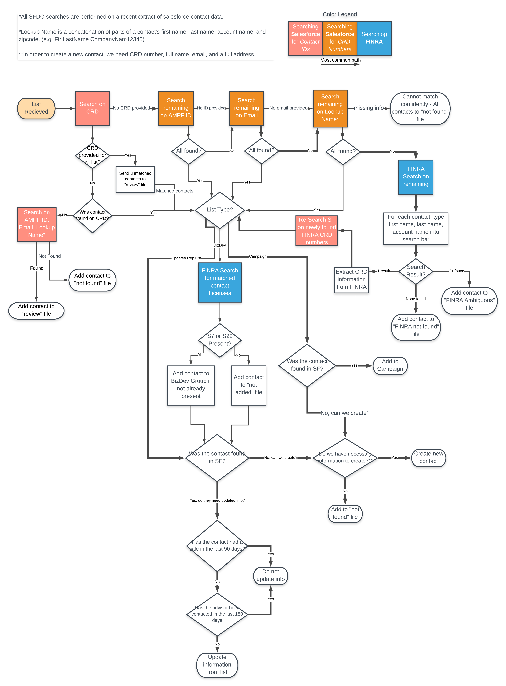

# List Management (L.I.M.A)
A python based software that ingests 3rd-party tabular (excel, csv, etc.) files for conference and rep lists and aims to ensure that a Salesforce CRM is up-to-date.

At it's core, LIMA is a matching system that can push necessary updates, given a data input. Enabling LIMA are a number of great libraries:

- [pandas](https://pypi.org/project/pandas/)
- [salesforce-bulk](https://pypi.org/project/salesforce-bulk/)
- [selenium](https://pypi.org/project/selenium/)
- [scikit-learn](https://pypi.org/project/scikit-learn/)
- [simple-salesforce](https://pypi.org/project/simple-salesforce/)
- [us](https://pypi.org/project/us/)
- [uszipcode](https://pypi.org/project/uszipcode/)

### How lists are processed


### Usage (Deprecated - need updated documentation as of version 4.2)

#### Full process
To leverage the entire functionality of the list program (LIMA), you need only perform the below.
New in version 4.0 is the ability to specify if you're manually running (ad-hoc) or if it's being controlled by a bot (cron'd/scheduled).
```python
from ListManagement.list_processing import ListProcessing

# to run in manual/ad-hoc mode
lp = ListProcessing(mode='manual').main_contact_based_processing()

# to run in cron'd/auto mode
lp = ListProcessing(mode='auto').main_contact_based_processing()
```

#### Individual components
The modules within the search node of LIMA lend themselves well to ad-hoc/one-off searches. Using the tools like the below will parse your input file into one (or more) output files. 

##### Finra
If you have a list of advisors where your data contains either a CRD number, or has the advisor's First, Last, and Company name, you can leverage the power of the Finra API. See the documentation for more details. 
```python
from ListManagement.search.finra import Finra
from PythonUtilities.LoggingUtility import Logging

log = Logging('Lima-Finra-AdHoc', 'LM_FAH').logger
fin = Finra(log=log)

path = '~/your/path/to/a/file.xlsx'

fin.scrape(path=path, parse_list=True, save=True)
```

##### Salesforce
Similar to the Finra scenario, if you have a file with CRD, Email, or or has the advisor's First, Last, and Company name, you can leverage the power of the Salesforce Search API. See the documentation for more details.
```python
from ListManagement.search.salesforce import Search
from PythonUtilities.LoggingUtility import Logging

log = Logging('Lima-Searc-AdHoc', 'LM_SAH').logger
search = Search(log=log)

path = '~/your/path/to/a/file.xlsx'

search.perform_search_one(searching_list_path=path, list_type='Campaign')

```

##### Search chaining
Similar to how the LIMA uses these modules, you can manufacture (if necessary) a similar process to take a given file, search it against 1) Salesforce, 2) attempt to identify any not found via a BrokerCheck search (Finra) and 3) research against Salesforce.
```python
from ListManagement.search import salesforce, finra
from PythonUtilities.LoggingUtility import Logging

log = Logging('Lima-Finra-AdHoc', 'LM_CAH').logger
sf_search = salesforce.Search(log)
fin_search = finra.Finra(log)

extracted = {'File Path': '~/your/path/to/a/file.xlsx'}

extracted.update(sf_search.perform_search_one(searching_list_path=extracted['File Path'], list_type='Campaign'))
extracted.update(fin_search.scrape(path=extracted['File Path'], scrape_type='crd', parse_list=True))
extracted.update(sf_search.perform_search_two(extracted['FINRA_SEC Found'], extracted['Found Path'], list_type='Campaign')) 
```
Written by Ricky Schools, with help from Max Charles, for FS Investments.
